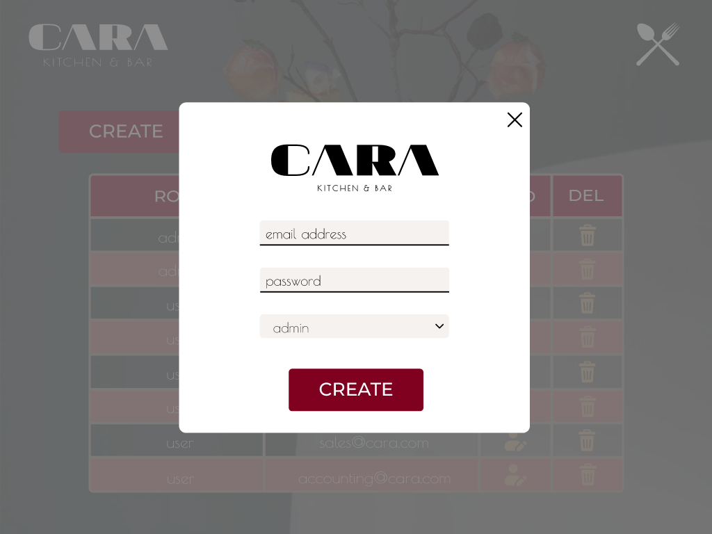
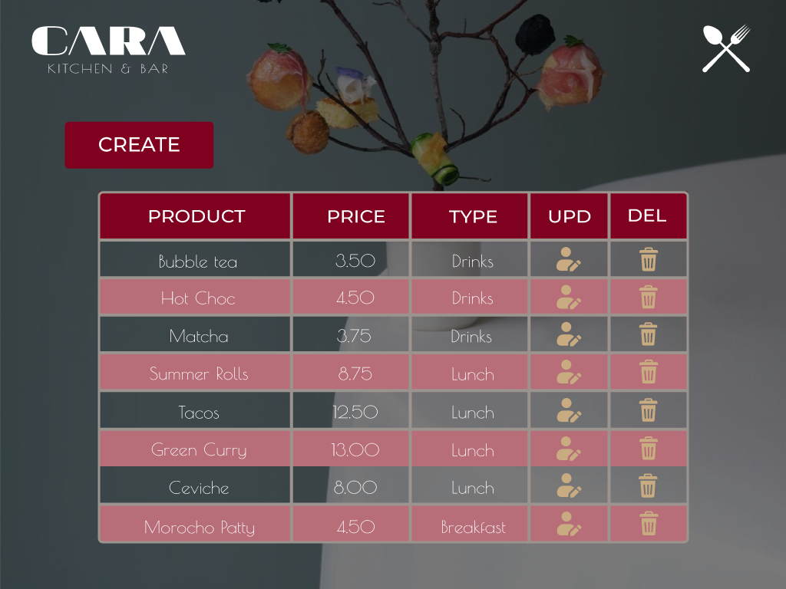
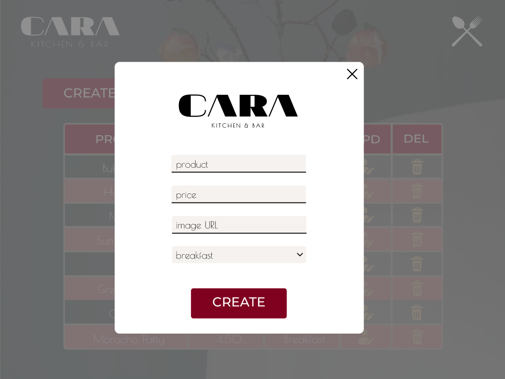
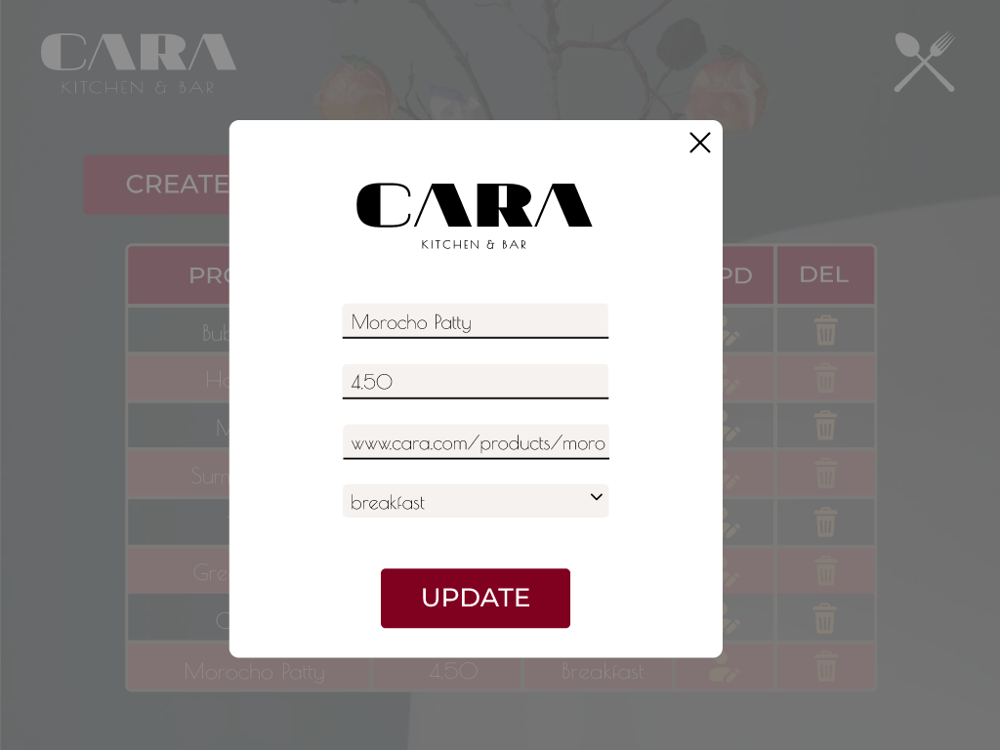
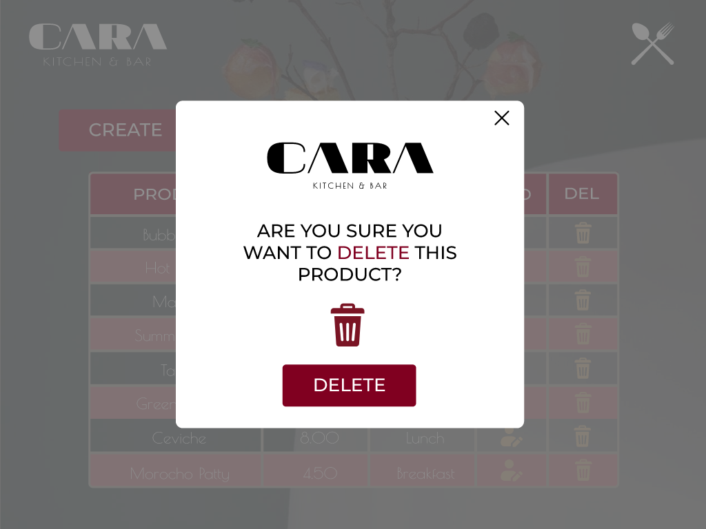
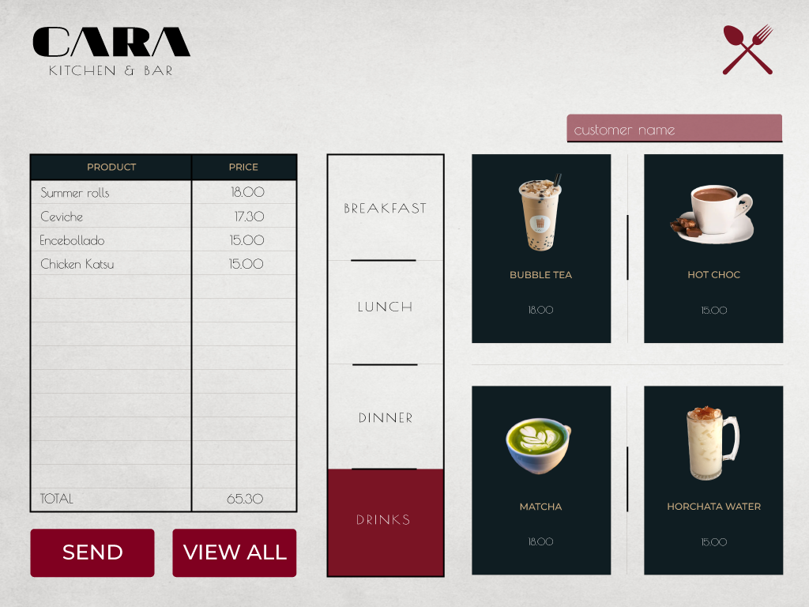
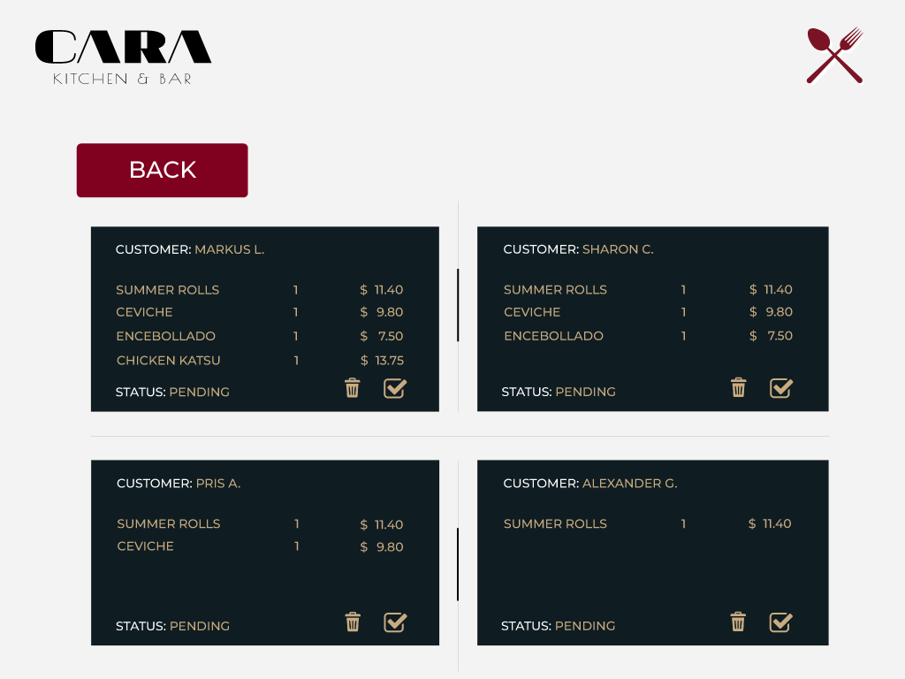
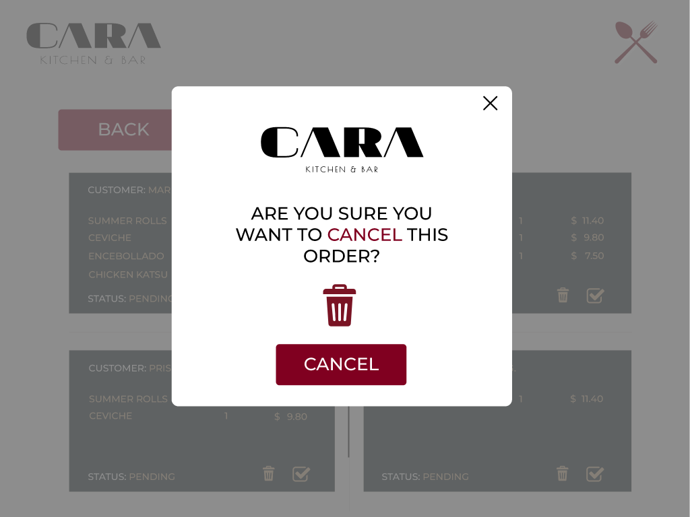
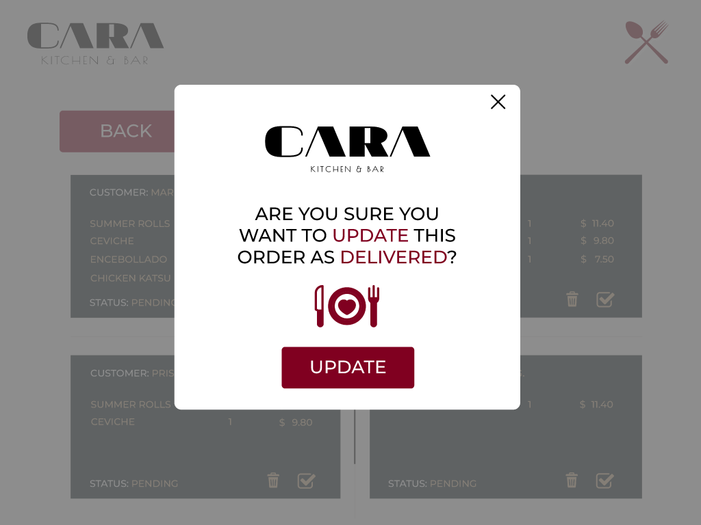

# CARA

This is a web application for managing products, users, and orders for a restaurant named CARA. It provides functionalities like user, product, and order CRUD operations. 

This project consists of two components: the client-side interface and the server-side API. Our client has requested to develop the interface that integrates with this [API](https://github.com/prisalvarado18/DEV002-burger-queen-api). 

## Interface
### Login and Menu

| Login | Menu |
|:------:|:------:|
| | |

### Users

| Users view | Create user |
|:------:|:------:|
| | |
| Update user | Delete user |
|

### Products
| Products view | Create product |
|:------:|:------:|
| | |
| Update product | Delete product | 
| 

### Orders
| Orders view | Order status |
|:------:|:------:|
| | |
| Cancel order | Update order | 
| 